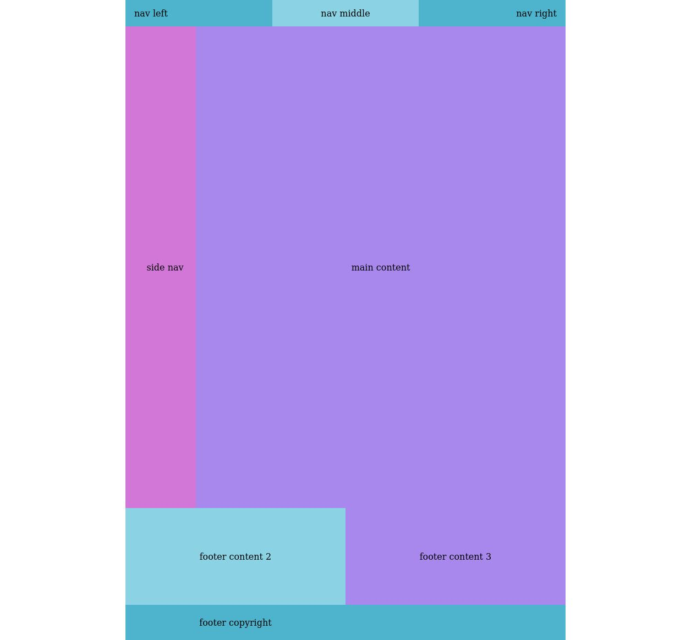
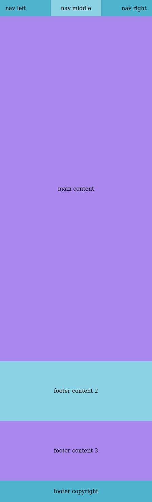

# starter template 

responsive template html and css

- navbar
- side navbar
- main content 
- 3 footer

clone
```bash 
git clone hhttps://github.com/dai-re/responsive-starter-template-.git
```
download
[HERE](https://github.com/dai-re/responsive-starter-template-/releases/tag/Zip)

`demo` http://daire.eu.org/responsive-starter-template-/

### dekstop 


### mobile

